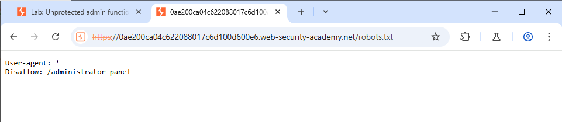
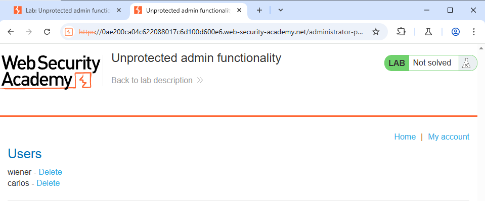

<H3>This lab has an unprotected admin panel.
Solve the lab by deleting the user `carlos`.</H3>

First we open the website and type robots.txt in the URL

This gives the URL to the administrator panel

Now adding the /administrator-panel to the URL

We get the URL hosting the users

We can now easily delete the user Carlos
