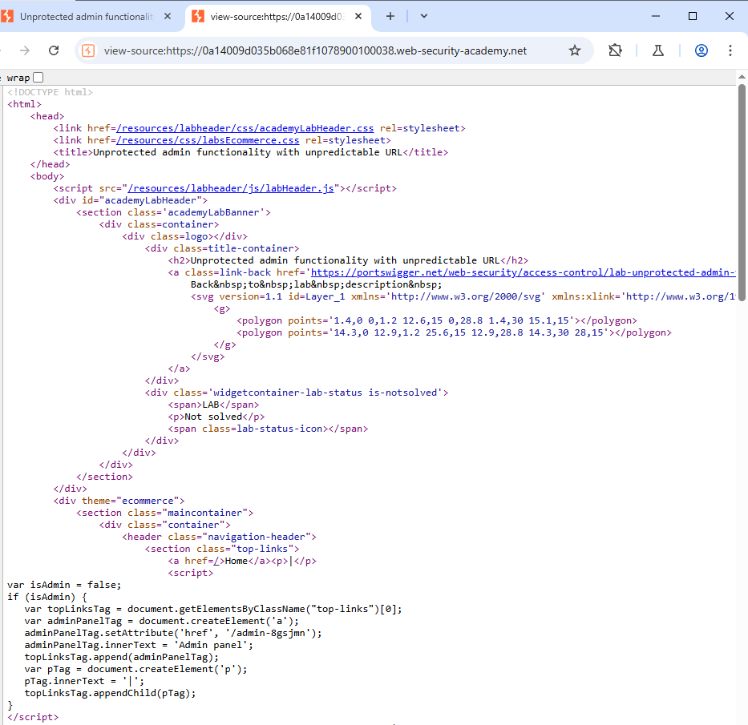
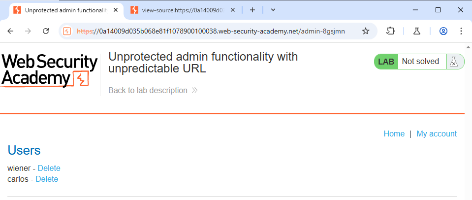

<H3>This lab has an unprotected admin panel. It's located at an unpredictable location, but the location is disclosed somewhere in the application.

Solve the lab by accessing the admin panel, and using it to delete the user `carlos`</H3>

First lets load the application and inspect the source code

After inspecting the source code → you can see the admin-panel URL

Lets add the admin panel URL to our website URL

And we found the Users
