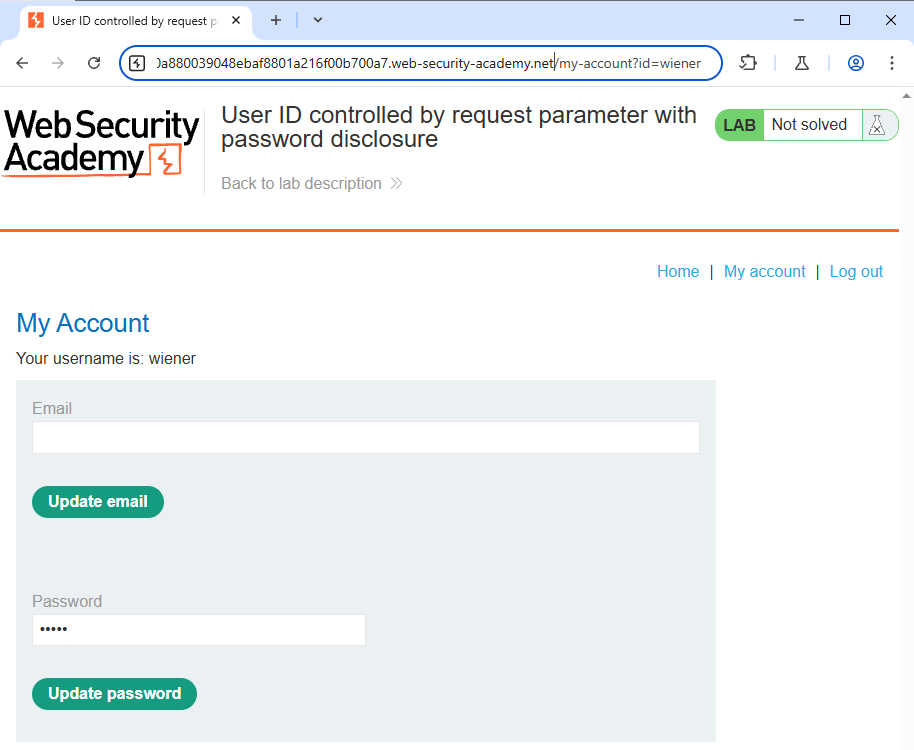
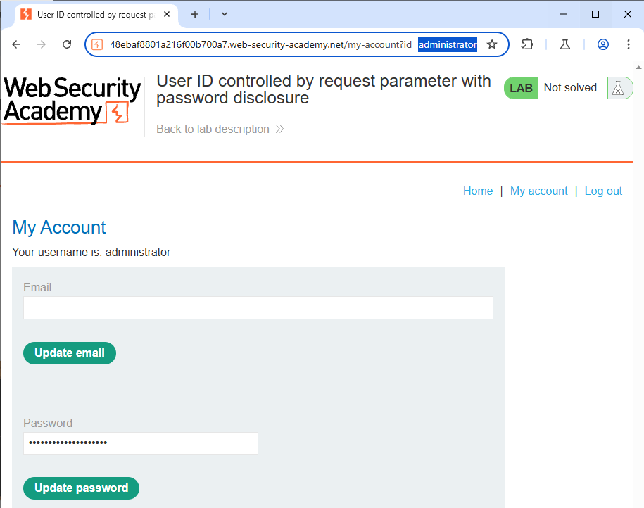
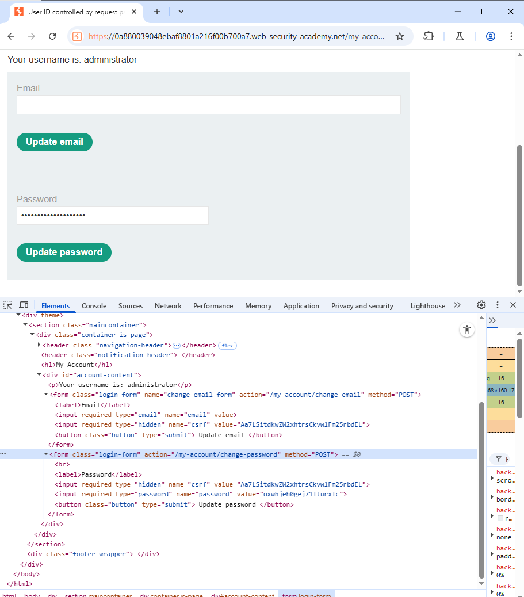
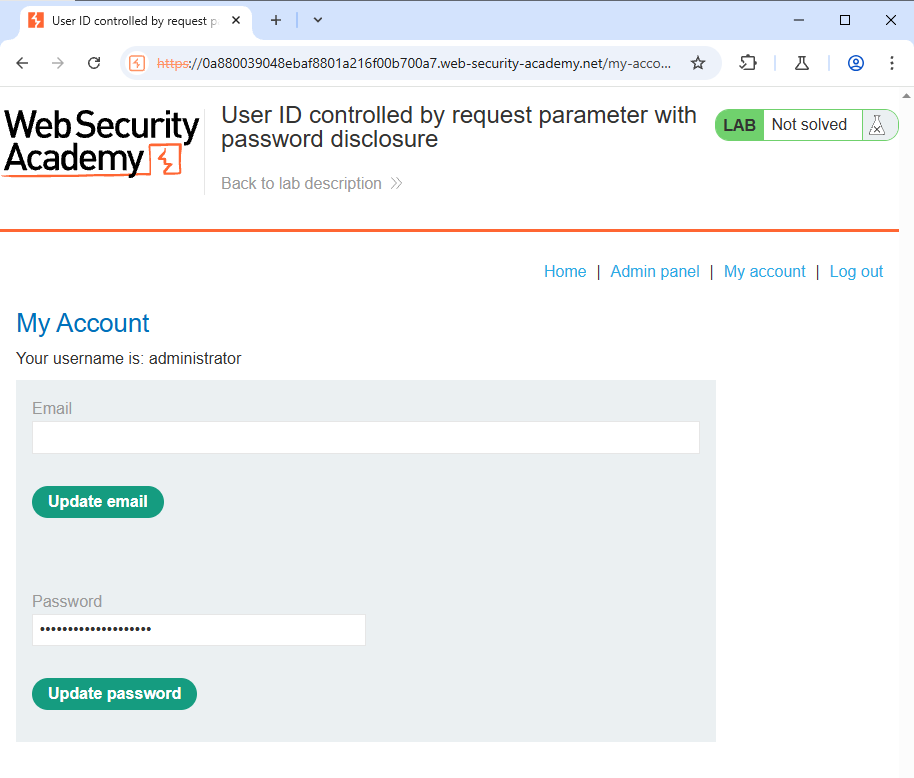

<H3>This lab has user account page that contains the current user's existing password, prefilled in a masked input.

To solve the lab, retrieve the administrator's password, then use it to delete the user `carlos`.
You can log in to your own account using the following credentials: `wiener:peter`</H3>

First login into the account with the given credentials

You can see the ID field in the URL - change it to administrator

You can see that you get the password field of the admin account
Now go onto inspect and and look for the password

You can see the value of the password

And you are in
Now go to administrator panel and delete the carlos account
