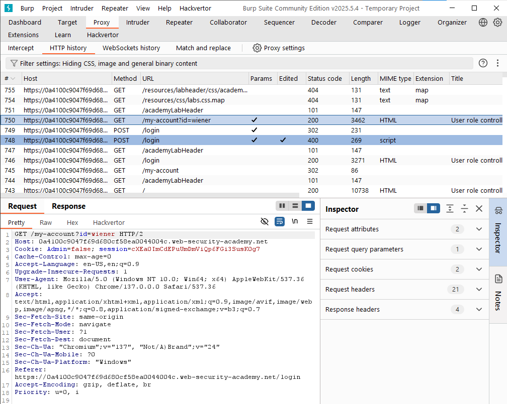
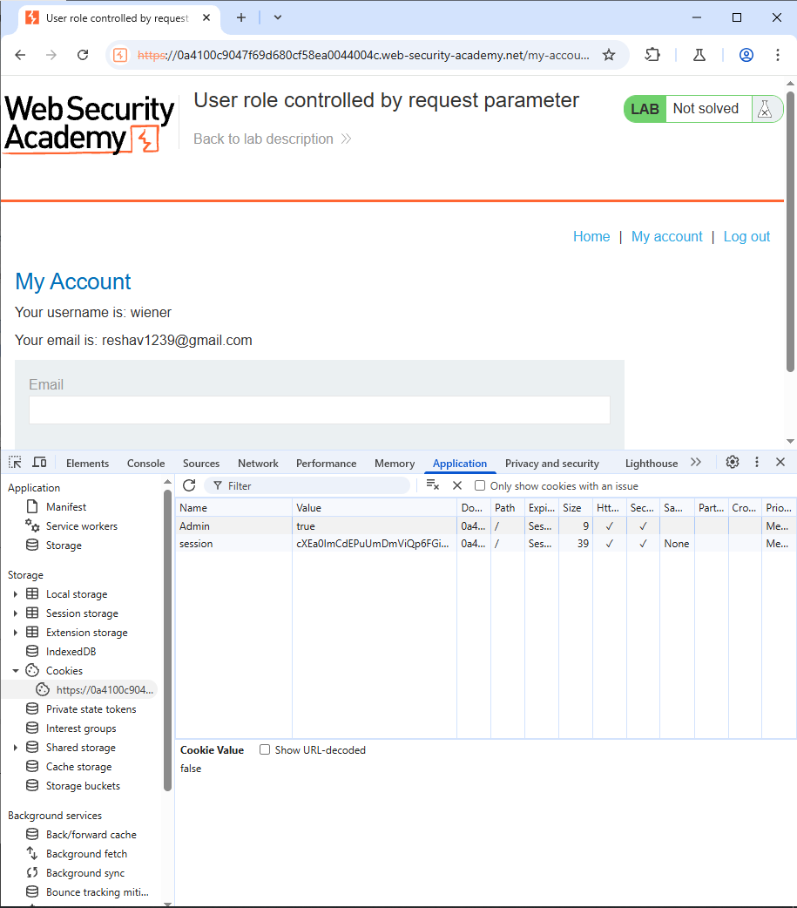
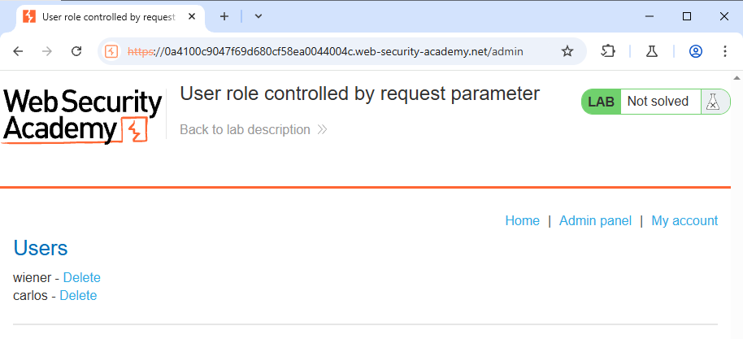

<H3>This lab has an admin panel at `/admin`, which identifies administrators using a forgeable cookie.

Solve the lab by accessing the admin panel and using it to delete the user `carlos`.

You can log in to your own account using the following credentials: `wiener:peter`</H3>

Lets login into the application using the given credentials
After login into the account we can inspect the request in the Burp

Here in the cookie we can see that Admin=False is written in the Cookie
Now lets go into the inspect of the browser and change the Admin=true in the Cookie

After changing the cookie you can see the admin panel

Lets delete the Carlos account and we have solved this lab
