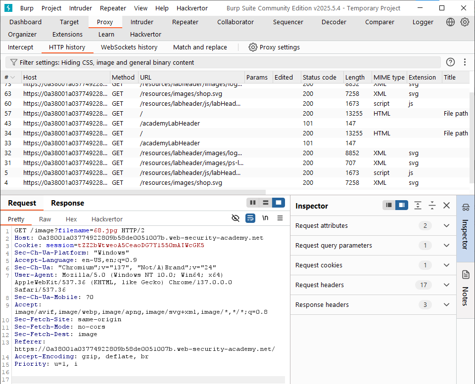
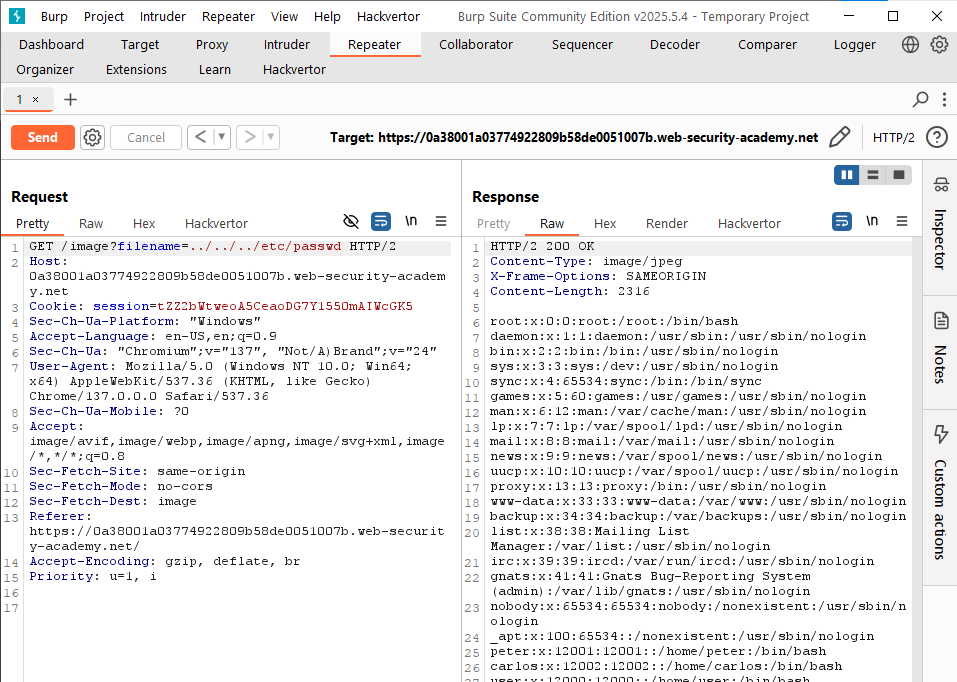

# Path Traversal

## **What is path traversal?**

Path traversal is also known as directory traversal. These vulnerabilities enable an attacker to read arbitrary files on the server that is running an application. This might include:

- Application code and data.
- Credentials for back-end systems.
- Sensitive operating system files.

In some cases, an attacker might be able to write to arbitrary files on the server, allowing them to modify application data or behavior, and ultimately take full control of the server.

# **Lab: File path traversal, simple case**

This lab contains a path traversal vulnerability in the display of product images.

To solve the lab, retrieve the contents of the `/etc/passwd` file.

Open the Burp browser and load the website

Then open Burp Suite and and go to the Proxy →  HTTP History and go to the filename=image request and open it

Send this request to repeater and modify the filename to ../../../etc/passwd to get the hidden files

**And we saw an Example of File Path Traversal** 
